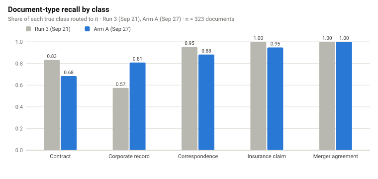
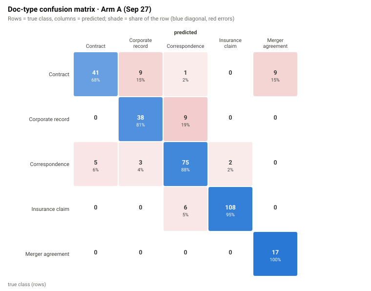
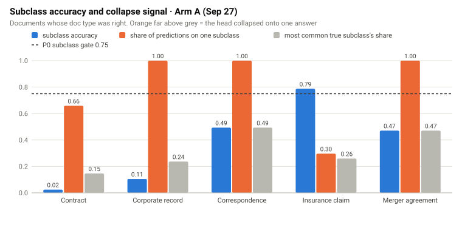
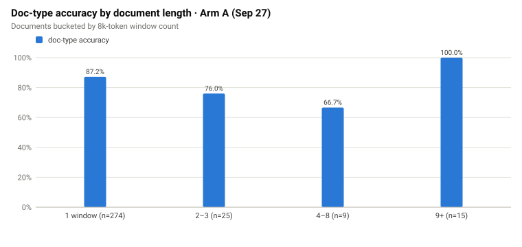
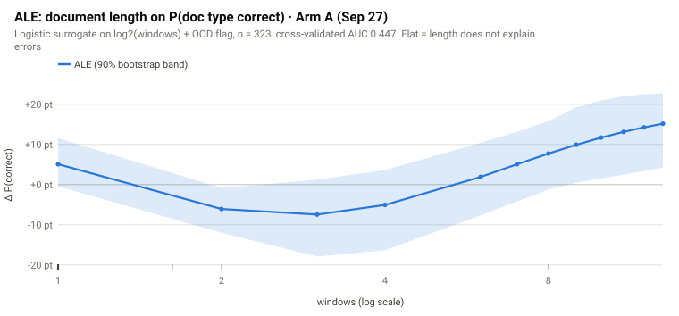
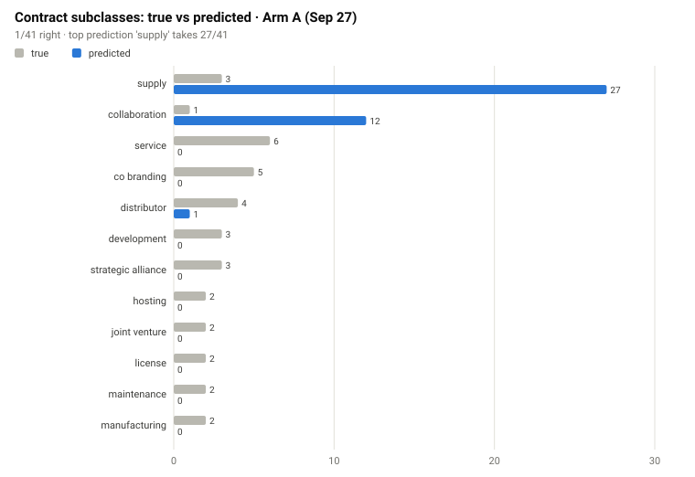
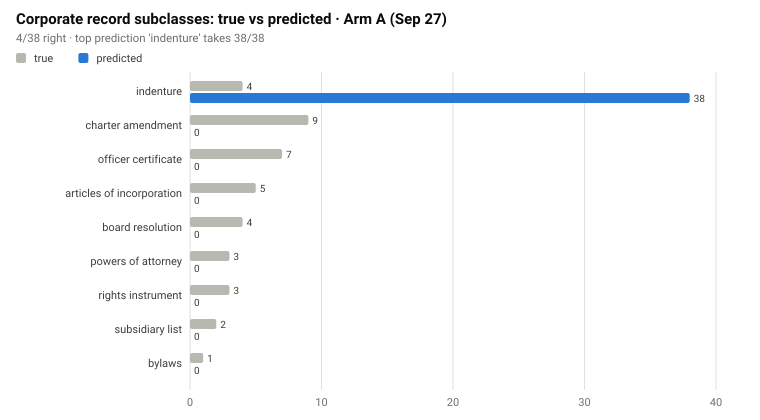
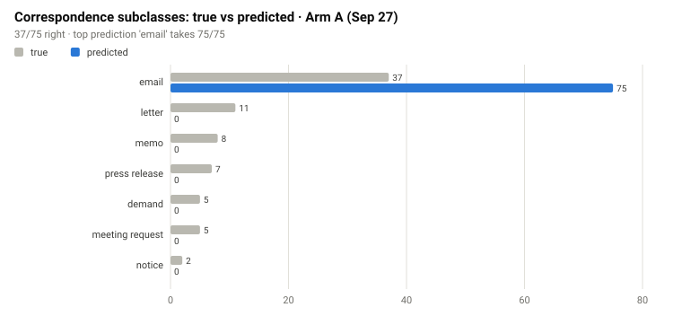
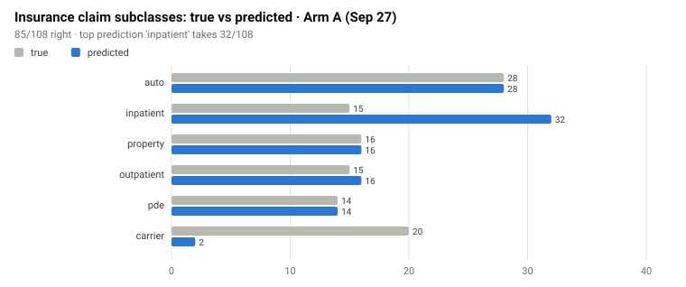
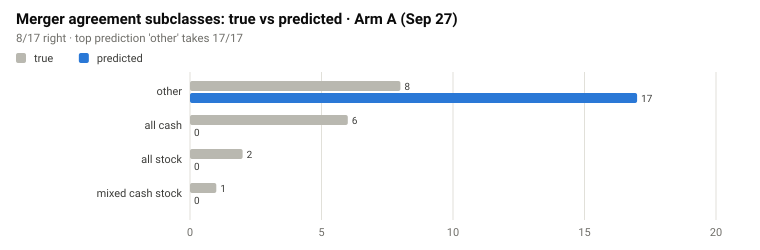

# Eval charts

Generated by `python -m mailroom_ml.viz.eval_charts` from:

- Run 3 (Sep 21): `reports/eval_run3_20260921.json`
- Arm A (Sep 27): `reports/eval_m9a-local-gpu1-armA-1ep-20260927-025236.json`

## Document-type recall by class

## Doc-type confusion matrix

## Subclass accuracy and collapse signal

## Doc-type accuracy by document length

## ALE of document length on P(doc type correct)

## Contract subclasses: true vs predicted

## Corporate record subclasses: true vs predicted

## Correspondence subclasses: true vs predicted

## Insurance claim subclasses: true vs predicted

## Merger agreement subclasses: true vs predicted

